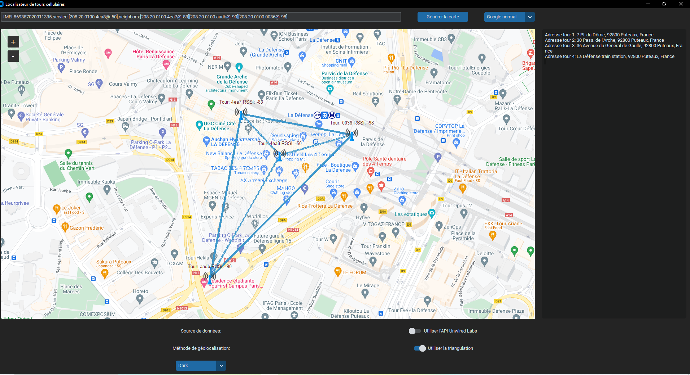
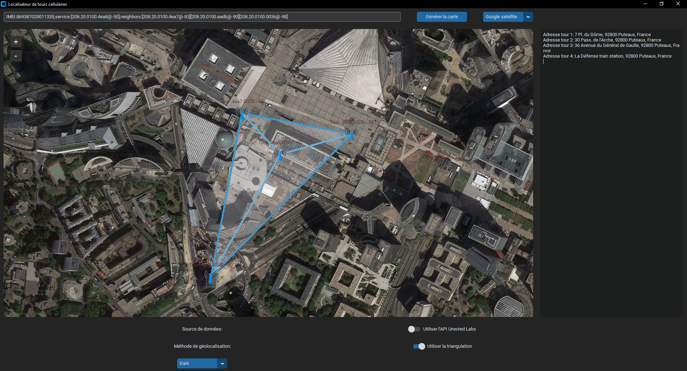
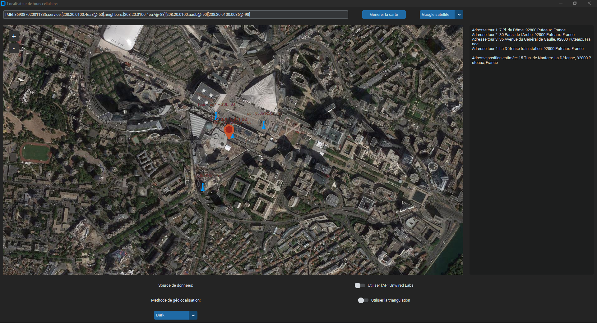

# GSM-Positioning

**GSM-Positioning** is an application that estimates the position of a GSM device using data from surrounding cell towers.  
It provides multiple positioning methods and displays the results on an interactive map.

---

## 🚀 Features

- **GSM device positioning**
  - Uses neighboring cell tower information (Cell-ID, LAC, MCC, MNC).
  - Supports two estimation methods:
    - **Triangulation** (with 3 or more towers).
    - **Average-based estimation** (fallback when triangulation is not possible).

- **Interactive map visualization**
  - Shows the estimated device location on a map.
  - Supports multiple map providers:
    - **Google Maps** (standard & satellite).
    - **OpenStreetMap**.

- **Flexible data sources**
  - **Local CSV** file (OpenCellID database extract).
  - **Unwired Labs API** for real-time tower data.

---

## 📂 Visual Examples

  
  


---

## 📊 Data Requirements

The included CSV file is only a **small extract**.  

⚠️ To use the full localization feature, download the complete dataset from:  
👉 [https://opencellid.org/](https://opencellid.org/)  

Place the `.csv` file inside the project directory.

---

## 🛠️ Installation

Clone the repository and install the dependencies:

```bash
git clone https://github.com/username/GSM-Positioning.git
cd GSM-Positioning
pip install -r requirements.txt
````

---

## ▶️ Usage

Run the application with:

```bash
python main.py
```

Then:

1. **Choose the data source**

   * Local CSV file.
   * Unwired Labs API.

2. **Select the positioning method**

   * Triangulation (requires at least 3 towers).
   * Average-based estimation.

3. **View results on the map**

   * Switch between Google Maps or OpenStreetMap.
   * Zoom and interact with the map to analyze the estimated location.

---

## 📜 License

This project is licensed under the **MIT License**.
See the [LICENSE](LICENSE) file for details.

